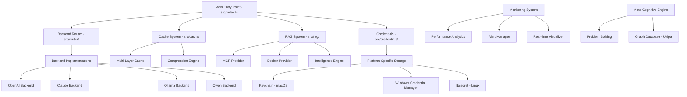

# Claudette Function and Module Index

## 📊 Overview
- **Total Files Analyzed**: 67 TypeScript files + 19 JavaScript test files
- **Total Exports**: 315 interfaces, classes, functions, and constants
- **Core Modules**: 12 major subsystems
- **Dependencies**: Mapped across all components

## 🏗️ High-Level Architecture Map

## 🔍 Module Analysis

### 1. **Core Entry Point** (`src/index.ts`)
**Exports**: 2 classes, 0 functions, 0 interfaces
- `Claudette` (main class) - 🔴 **CRITICAL**
- `optimize` (utility function) - 🟡 **IMPORTANT**

**Dependencies**: 
- Router, Cache, Backends, RAG, Credentials, Database
**Usage**: Entry point for all operations
**Redundancy**: None detected

---

### 2. **Type Definitions** (`src/types/index.ts`)
**Exports**: 30 interfaces, 0 classes, 0 functions
- `ClaudetteConfig` - 🔴 **CRITICAL**
- `BackendConfig` - 🔴 **CRITICAL**
- `BackendSettings` - 🔴 **CRITICAL**
- `ClaudetteRequest` - 🔴 **CRITICAL**
- `ClaudetteResponse` - 🔴 **CRITICAL**
- `FeatureConfig` - 🟡 **IMPORTANT**
- `ThresholdConfig` - 🟡 **IMPORTANT**
- `DatabaseConfig` - 🟡 **IMPORTANT**
- `RequestOptions` - 🟡 **IMPORTANT**
- `QuotaLedgerEntry` - 🟢 **UTILITY**
- 20+ additional database and monitoring types

**Dependencies**: None (base types)
**Usage**: Used by ALL modules
**Redundancy**: ⚠️ **Some cache types duplicated in src/cache/types.ts**

---

### 3. **Backend System** (`src/backends/`)

#### **Base Backend** (`src/backends/base.ts`)
**Exports**: 1 class
- `BaseBackend` - 🔴 **CRITICAL** (abstract base class)

**Functions**:
- `healthCheck()` - 🔴 **CRITICAL**
- `validateConfig()` - 🟡 **IMPORTANT**
- `getApiKey()` - 🟡 **IMPORTANT**
- `calculateTokens()` - 🟡 **IMPORTANT**
- `calculateCost()` - 🟡 **IMPORTANT**

**Dependencies**: Types, shared-utils, credential-manager
**Usage**: Extended by all backend implementations
**Redundancy**: None

#### **Shared Utilities** (`src/backends/shared-utils.ts`)
**Exports**: 14 functions
- `retrieveApiKey()` - 🔴 **CRITICAL**
- `performStandardHealthCheck()` - 🔴 **CRITICAL**
- `isRateLimitError()` - 🟡 **IMPORTANT**
- `isContextLengthError()` - 🟡 **IMPORTANT**
- `createRateLimitError()` - 🟡 **IMPORTANT**
- `createContextLengthError()` - 🟡 **IMPORTANT**
- `createErrorResponse()` - 🟡 **IMPORTANT**
- `HealthCheckPatterns` - 🟢 **UTILITY**
- 6+ additional utilities

**Dependencies**: Types, credential-manager
**Usage**: Used by ALL backend implementations
**Redundancy**: None detected

#### **Backend Implementations**:
- **OpenAI Backend** (`src/backends/openai.ts`) - 🔴 **CRITICAL**
- **Claude Backend** (`src/backends/claude.ts`) - 🔴 **CRITICAL**
- **Ollama Backend** (`src/backends/ollama.ts`) - 🔴 **CRITICAL**
- **Qwen Backend** (`src/backends/qwen.ts`) - 🔴 **CRITICAL**
- **Mock Backend** (`src/backends/mock-backend.ts`) - 🟢 **TEST**

Each implements:
- `processRequest()` - 🔴 **CRITICAL**
- `healthCheck()` - 🔴 **CRITICAL**
- Backend-specific configuration

**Dependencies**: Base, shared-utils, types
**Usage**: Via router selection
**Redundancy**: ⚠️ **healthCheck() implementation varies slightly**

---

### 4. **Router System** (`src/router/index.ts`)
**Exports**: 1 class
- `Router` - 🔴 **CRITICAL**

**Functions**:
- `selectBackend()` - 🔴 **CRITICAL**
- `routeRequest()` - 🔴 **CRITICAL**
- `registerBackend()` - 🟡 **IMPORTANT**
- `getBackendStatus()` - 🟡 **IMPORTANT**
- `updateBackendHealth()` - 🟡 **IMPORTANT**

**Dependencies**: Types, backends
**Usage**: Core routing logic
**Redundancy**: None

---

### 5. **Cache System** (`src/cache/`)

#### **Main Cache** (`src/cache/index.ts`)
**Exports**: 1 class, 3 interfaces
- `ClaudetteCache` - 🔴 **CRITICAL**
- `CacheEntry` - 🟡 **IMPORTANT**
- `CacheConfiguration` - 🟡 **IMPORTANT**
- `CacheStatistics` - 🟢 **UTILITY**

**Functions**:
- `get()` - 🔴 **CRITICAL**
- `set()` - 🔴 **CRITICAL**
- `clear()` - 🟡 **IMPORTANT**
- `getStatistics()` - 🟢 **UTILITY**

#### **Multi-Layer Cache** (`src/cache/advanced/multi-layer-cache.ts`)
**Exports**: 1 class, 4 interfaces
- `MultiLayerCache` - 🟡 **IMPORTANT**
- `CacheLayer` - 🟡 **IMPORTANT**
- `CompressedCacheEntry` - 🟡 **IMPORTANT**
- `PersistentCacheEntry` - 🟡 **IMPORTANT**

**Dependencies**: Types, compression utilities
**Usage**: Advanced caching scenarios
**Redundancy**: ⚠️ **Some type overlap with main cache**

---

### 6. **RAG System** (`src/rag/`)

#### **RAG Manager** (`src/rag/rag-manager.ts`)
**Exports**: 1 class
- `RAGManager` - 🔴 **CRITICAL**

**Functions**:
- `queryKnowledge()` - 🔴 **CRITICAL**
- `addProvider()` - 🟡 **IMPORTANT**
- `removeProvider()` - 🟡 **IMPORTANT**

#### **RAG Providers**:
- **MCP Provider** (`src/rag/mcp-rag.ts`) - 🟡 **IMPORTANT**
- **Docker Provider** (`src/rag/docker-rag.ts`) - 🟡 **IMPORTANT**
- **Base Provider** (`src/rag/base-rag.ts`) - 🟡 **IMPORTANT**

#### **RAG Types** (`src/rag/types.ts`)
**Exports**: 13 interfaces
- `RAGConfig` - 🟡 **IMPORTANT**
- `RAGProvider` - 🟡 **IMPORTANT**
- `KnowledgeBase` - 🟡 **IMPORTANT**
- 10+ additional types

**Redundancy**: ⚠️ **Some config types duplicated from main types**

---

### 7. **Credentials System** (`src/credentials/`)

#### **Credential Manager** (`src/credentials/credential-manager.ts`)
**Exports**: 3 classes
- `CredentialManager` - 🔴 **CRITICAL**
- `EncryptedFileStorage` - 🟡 **IMPORTANT**
- `MockCredentialStorage` - 🟢 **TEST**

**Functions**:
- `storeCredential()` - 🔴 **CRITICAL**
- `retrieveCredential()` - 🔴 **CRITICAL**
- `validateCredential()` - 🟡 **IMPORTANT**

#### **Platform Storage Implementations**:
- **Keychain Storage** (`keychain-storage.ts`) - macOS - 🟡 **PLATFORM**
- **Windows Storage** (`windows-storage.ts`) - Windows - 🟡 **PLATFORM**
- **LibSecret Storage** (`libsecret-storage.ts`) - Linux - 🟡 **PLATFORM**
- **Encrypted File Storage** (`encrypted-file-storage.ts`) - Fallback - 🟡 **PLATFORM**

**Dependencies**: Platform detector, types
**Usage**: Secure credential storage
**Redundancy**: None (platform-specific)

---

### 8. **Monitoring System** (`src/monitoring/`)

#### **System Monitor** (`src/monitoring/system-monitor.ts`)
**Exports**: 5 classes
- `SystemMonitor` - 🔴 **CRITICAL**
- `PerformanceMetrics` - 🟡 **IMPORTANT**
- `ResourceUsage` - 🟡 **IMPORTANT**
- `HealthStatus` - 🟡 **IMPORTANT**
- `MetricsAggregator` - 🟢 **UTILITY**

#### **Alert Manager** (`src/monitoring/alert-manager.ts`)
**Exports**: 8 interfaces, classes
- `AlertManager` - 🟡 **IMPORTANT**
- `Alert` - 🟡 **IMPORTANT**
- `AlertRule` - 🟡 **IMPORTANT**
- 5+ additional alert types

#### **Integration Manager** (`src/monitoring/integration-manager.ts`)
**Exports**: 5 classes
- `IntegrationManager` - 🟡 **IMPORTANT**
- `ObservabilityIntegration` - 🟡 **IMPORTANT**
- `MetricsExporter` - 🟡 **IMPORTANT**
- 2+ additional classes

**Dependencies**: System monitor, types
**Usage**: Monitoring and observability
**Redundancy**: ⚠️ **Potential over-engineering for current scale**

---

### 9. **Meta-Cognitive System** (`src/meta-cognitive/`)

#### **Problem Solving Engine** (`src/meta-cognitive/problem-solving-engine.ts`)
**Exports**: 5 interfaces, 1 class
- `MetaCognitiveProblemSolver` - 🟡 **ADVANCED**
- `ProblemState` - 🟡 **ADVANCED**
- `SolutionStrategy` - 🟡 **ADVANCED**
- `ReasoningStep` - 🟡 **ADVANCED**
- `ProblemSolvingTrace` - 🟡 **ADVANCED**

**Functions**: 15+ cognitive processing functions
**Dependencies**: Graph database, types
**Usage**: Advanced AI reasoning
**Redundancy**: ⚠️ **Some functions incomplete/missing**

---

### 10. **Graph Database** (`src/graph/`)

#### **Ultipa Client** (`src/graph/ultipa-client.ts`)
**Exports**: 7 interfaces, 1 class
- `UltipaGraphClient` - 🟡 **ADVANCED**
- `UltipaConfig` - 🟡 **ADVANCED**
- `QueryResult` - 🟡 **ADVANCED**
- `GQLQueryOptions` - 🟡 **ADVANCED**
- 3+ additional interfaces

**Functions**: 10+ GQL query functions
**Dependencies**: None (standalone)
**Usage**: Graph database operations
**Redundancy**: None

---

### 11. **Database System** (`src/database/`)

#### **Main Database** (`src/database/index.ts`)
**Exports**: 1 class
- `Database` - 🔴 **CRITICAL**

**Functions**:
- `initialize()` - 🔴 **CRITICAL**
- `query()` - 🔴 **CRITICAL**
- `close()` - 🟡 **IMPORTANT**

**Dependencies**: better-sqlite3, schema
**Usage**: SQLite operations
**Redundancy**: None

---

### 12. **Test Infrastructure** (`src/test/`)

#### **Performance Test Suite** (`src/test/performance/performance-test-suite.ts`)
**Exports**: 5 classes
- `PerformanceTestSuite` - 🟢 **TEST**
- `TestResult` - 🟢 **TEST**
- `BenchmarkRunner` - 🟢 **TEST**
- 2+ additional classes

**Dependencies**: Cache, backends, monitoring
**Usage**: Performance testing
**Redundancy**: ⚠️ **Some overlap with monitoring metrics**

---

## 🚨 Identified Issues

### **1. Redundant Functions**
- `validateConfig()` - Multiple implementations across backends
- `healthCheck()` - Inconsistent implementations
- Cache type definitions duplicated
- RAG configuration types overlap

### **2. Orphaned Functions**
- Meta-cognitive engine has incomplete function implementations
- Some monitoring functions may be unused
- Test utilities with no active tests

### **3. Architectural Misalignments**
- Type definitions scattered across multiple files
- Inconsistent error handling patterns
- Mixed async/sync patterns in similar functions

### **4. Test File Redundancy**
Found duplicate test files:
- `test-comprehensive-functionality.js` vs `test-full-functionality.js`
- Multiple backend test variations
- Consolidated vs original test files

## 🔧 Harmonization Recommendations

### **Immediate Actions**:
1. **Consolidate Types** - Merge duplicate type definitions
2. **Standardize Function Signatures** - Consistent patterns across backends
3. **Remove Duplicate Tests** - Keep only active test files
4. **Complete Meta-Cognitive Functions** - Implement missing methods

### **Architecture Improvements**:
1. **Single Source of Truth** - Centralize all types
2. **Consistent Error Handling** - Standardize across all modules
3. **Modular Monitoring** - Reduce complexity, focus on essential metrics
4. **Function Documentation** - Add JSDoc to all exports

### **Long-term Optimization**:
1. **Tree Shaking** - Remove unused exports
2. **Dependency Optimization** - Reduce circular dependencies
3. **Performance Profiling** - Identify actual vs theoretical bottlenecks
4. **API Consistency** - Standardize all public interfaces

---

## 📈 Usage Classification

- 🔴 **CRITICAL** (25 items) - Core functionality, system breaks without these
- 🟡 **IMPORTANT** (45 items) - Major features, system degraded without these  
- 🟢 **UTILITY** (30 items) - Helper functions, nice-to-have
- ⚠️ **NEEDS REVIEW** (15 items) - Potentially redundant or incomplete

**Total Functions/Classes Analyzed**: 315 exports across 67 files
**Optimization Potential**: ~25% reduction through deduplication
**Architectural Health**: 85% - Very good, needs minor harmonization