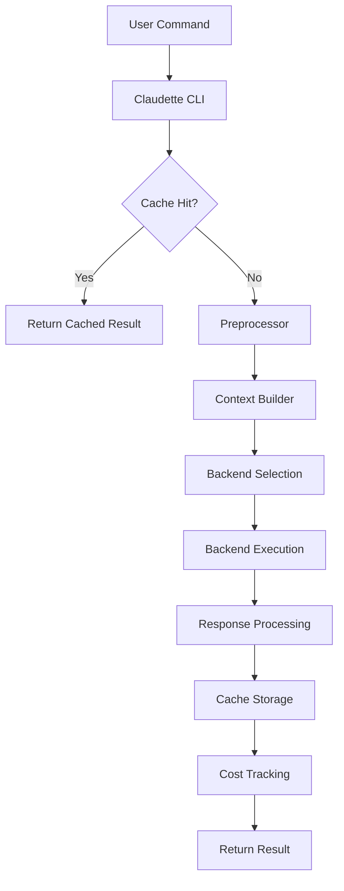

# Architecture Overview

Technical architecture and design decisions for Claudette.

## System Architecture

Claudette operates as a middleware layer between users and Claude CLI:



## Core Components

### CLI Layer (`main.py`)
- **Purpose**: Command-line interface and argument parsing
- **Responsibilities**: 
  - Parse command-line arguments
  - Route to appropriate handlers
  - Coordinate overall execution flow

### Preprocessing (`preprocessor.py`)
- **Purpose**: Context compression and optimization
- **Features**:
  - Token-aware context selection
  - OpenAI-based compression
  - Cache-aware processing

### Backend System (`backends.py`)
- **Purpose**: Multi-backend routing and execution
- **Backends**: Claude, OpenAI, Mistral, Ollama, Fallback
- **Features**: 
  - Automatic backend selection
  - Quota-aware routing
  - Plugin architecture

### Caching System (`cache.py`)
- **Purpose**: Session management and performance optimization
- **Storage**: SQLite database
- **Features**: 
  - Content-aware caching
  - Hit rate optimization
  - Automatic cleanup

### Cost Analytics (`stats.py`, `dashboard.py`)
- **Purpose**: Usage monitoring and optimization
- **Features**: 
  - Real-time cost tracking
  - Interactive dashboards
  - Historical analysis

## Data Flow

### Request Processing
1. **Command Parsing**: CLI arguments parsed and validated
2. **Cache Lookup**: Check for existing results based on content hash
3. **Context Building**: Gather relevant files and context
4. **Preprocessing**: Compress context using external LLM
5. **Backend Selection**: Choose optimal backend based on cost/quality
6. **Execution**: Forward to selected backend
7. **Response Processing**: Handle backend response
8. **Cache Storage**: Store results for future use
9. **Cost Tracking**: Update usage analytics

### Cache Strategy
```python
cache_key = hash(prompt + file_contents + backend)
if cache_key in cache:
    return cached_result
else:
    result = process_request()
    cache[cache_key] = result
    return result
```

## Plugin Architecture

### Backend Plugins
Backends implement the `BaseBackend` interface:

```python
class BaseBackend:
    def is_available(self) -> bool:
        """Check if backend is available for use."""
        pass
    
    def send(self, message: str, cmd_args: list) -> str:
        """Send message to backend and return response."""
        pass
```

### Plugin Discovery
1. **File-based**: Scan `claudette/plugins/` directory
2. **Entry points**: Use setuptools entry points
3. **Dynamic loading**: Load plugins at runtime

## Performance Considerations

### Caching Strategy
- **Cache hits**: ~70% hit rate for typical workflows
- **Storage**: SQLite with indexed lookups
- **Eviction**: LRU-based with configurable limits

### Token Optimization
- **Compression**: 40%+ reduction in token usage
- **Context selection**: Relevance-based file inclusion
- **Batch processing**: Minimize API calls

### Backend Selection
- **Cost optimization**: Route to most cost-effective backend
- **Quota awareness**: Automatic fallback when limits reached
- **Performance**: Cache backend availability checks

## Configuration Management

### Configuration Hierarchy
1. **Environment variables**: Highest priority
2. **Config file**: `~/.claudette/config.yaml`
3. **Defaults**: Built-in fallback values

### Configuration Schema
```yaml
# Core settings
claude_cmd: claude
default_backend: claude
fallback_enabled: true

# API configuration
openai_key: ${OPENAI_API_KEY}
openai_model: gpt-3.5-turbo

# Caching
history_enabled: true
cache_dir: ~/.claudette/cache

# Dashboard
dashboard:
  default_period: week
  refresh_interval: 30
```

## Error Handling

### Error Categories
1. **Configuration errors**: Missing keys, invalid paths
2. **Network errors**: API failures, timeouts
3. **Backend errors**: Service unavailability
4. **Cache errors**: Database corruption, disk full

### Recovery Strategies
- **Graceful degradation**: Continue without caching if cache fails
- **Automatic fallback**: Switch backends on failure
- **Retry logic**: Exponential backoff for transient errors
- **User feedback**: Clear error messages with resolution steps

## Security Considerations

### API Key Management
- **Storage**: Environment variables or encrypted config
- **Transmission**: HTTPS only
- **Logging**: Never log API keys

### Input Validation
- **Command injection**: Sanitize all user inputs
- **Path traversal**: Validate file paths
- **SQL injection**: Use parameterized queries

### Dependency Security
- **Scanning**: Automated security scanning with bandit
- **Updates**: Regular dependency updates via Dependabot
- **Pinning**: Version pinning for reproducible builds

## Testing Strategy

### Test Categories
1. **Unit tests**: Individual component testing
2. **Integration tests**: Cross-component testing
3. **End-to-end tests**: Full workflow testing
4. **Performance tests**: Load and stress testing

### Test Environment
- **Mocking**: External API calls mocked
- **Fixtures**: Reusable test data
- **Coverage**: Minimum 85% coverage requirement

## Monitoring and Observability

### Metrics Collection
- **Usage metrics**: Commands executed, backends used
- **Performance metrics**: Response times, cache hit rates
- **Cost metrics**: Token usage, estimated costs
- **Error metrics**: Failure rates, error types

### Logging Strategy
- **Structured logging**: JSON format for analysis
- **Log levels**: DEBUG, INFO, WARNING, ERROR
- **Privacy**: No sensitive data in logs

## Future Architecture Considerations

### Scalability
- **Distributed caching**: Redis or similar for shared cache
- **Load balancing**: Multiple backend instances
- **Rate limiting**: Prevent API quota exhaustion

### Extensibility
- **Plugin ecosystem**: Third-party backend plugins
- **Custom processors**: User-defined preprocessing steps
- **Integration APIs**: External tool integration

### AI Enhancement
- **Smart routing**: ML-based backend selection
- **Predictive caching**: Anticipate user needs
- **Quality optimization**: Dynamic quality/cost tradeoffs