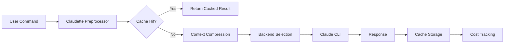

# Claudette Documentation

**Claude Code compatible CLI with preprocessing, multi-backend plugins, and cost analytics**

[](https://github.com/ruvnet/claude-flow/actions/workflows/ci.yaml)
[](https://codecov.io/gh/ruvnet/claude-flow)
[](https://badge.fury.io/py/claudette)
[](https://ruvnet.github.io/claude-flow)
[](https://opensource.org/licenses/MIT)

## Overview

Claudette is a sophisticated CLI wrapper for Claude Code that enhances your AI development workflow with:

- **🎯 Intelligent Preprocessing** - Context compression with external LLMs to optimize token usage
- **🔄 Multi-Backend Support** - Seamless routing between Claude, OpenAI, Mistral, and Ollama
- **💰 Cost Analytics** - Comprehensive cost tracking with interactive dashboards
- **⚡ Session Caching** - Smart caching prevents recompression of identical operations
- **📊 Real-time Monitoring** - Terminal and web dashboards for usage analytics

## Key Features

### Multi-Backend Intelligence
Route your requests to the most cost-effective backend:
```bash
claudette edit app.py --backend claude --explain "optimize performance"
claudette edit app.py --backend openai --explain "add error handling"
claudette edit app.py --backend ollama --explain "add documentation"
```

### Cost Dashboard & Analytics
Monitor and optimize your AI usage costs:
```bash
# View cost statistics
claudette stats --period week --backend claude

# Interactive terminal dashboard
claudette dashboard terminal --live

# Web-based analytics
claudette dashboard web --port 8080
```

### Session Caching
Intelligent caching system prevents redundant operations:
```bash
# First run: compresses and executes
claudette edit app.py --explain "optimize"

# Second identical run: cache hit, reuses compression
claudette edit app.py --explain "optimize"  # ⚡ Instant response
```

## Quick Start

### Installation

=== "pip"
    ```bash
    pip install claudette
    ```

=== "Homebrew"
    ```bash
    brew tap ruvnet/claude-flow
    brew install claudette
    ```

=== "Development"
    ```bash
    git clone https://github.com/ruvnet/claude-flow.git
    cd claude-flow
    pip install -e ".[dev]"
    ```

### Configuration

Create `~/.claudette/config.yaml`:
```yaml
claude_cmd: claude
openai_key: your_openai_api_key
openai_model: gpt-3.5-turbo
fallback_enabled: true
history_enabled: true
cache_dir: ~/.claudette/cache
```

### Basic Usage

```bash
# Edit files with AI assistance
claudette edit myfile.py --explain "add error handling"

# Create commits with context
claudette commit --message "implement user authentication"

# View session history
claudette history --last 10

# Monitor costs
claudette stats --period today
```

## Architecture

Claudette operates as an intelligent middleware layer:



## Next Steps

- [Installation Guide](installation.md) - Detailed setup instructions
- [Usage Guide](usage.md) - Comprehensive usage examples
- [Cost Dashboard](guides/cost_dashboard.md) - Cost optimization strategies
- [API Reference](api/index.md) - Complete API documentation
- [Contributing](how_to_contribute.md) - Development workflow

## Community

- **GitHub**: [ruvnet/claude-flow](https://github.com/ruvnet/claude-flow)
- **PyPI**: [claudette](https://pypi.org/project/claudette/)
- **Issues**: [Bug Reports & Feature Requests](https://github.com/ruvnet/claude-flow/issues)
- **Discussions**: [GitHub Discussions](https://github.com/ruvnet/claude-flow/discussions)