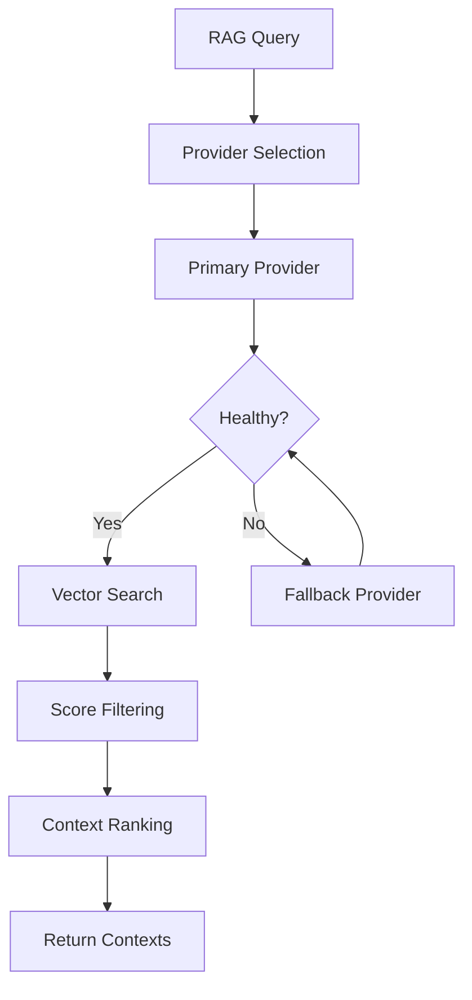
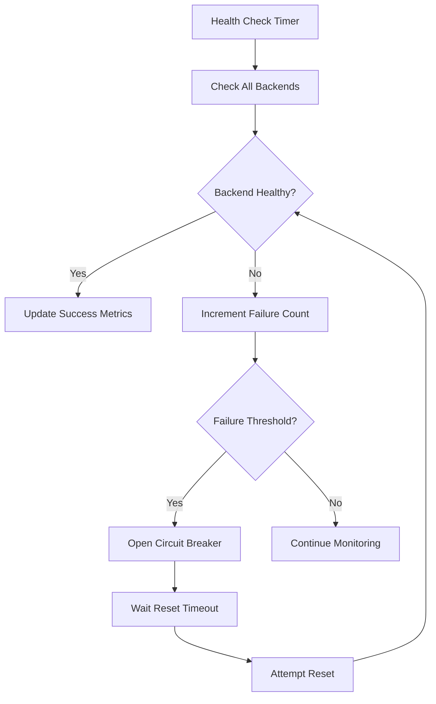

# Claudette Architecture Documentation

> **Technical Architecture Overview for Claudette v2.1.6**
> 
> This document provides a comprehensive technical overview of Claudette's enterprise AI middleware architecture, design patterns, and system components including the latest infrastructure enhancements.

## Table of Contents

- [System Overview](#system-overview)
- [Core Architecture](#core-architecture)
- [Component Design](#component-design)
- [Data Flow](#data-flow)
- [Performance Architecture](#performance-architecture)
- [Security Architecture](#security-architecture)
- [Extensibility & Plugins](#extensibility--plugins)
- [Deployment Patterns](#deployment-patterns)

---

## System Overview

Claudette is designed as a high-performance AI middleware platform that provides intelligent routing, cost optimization, and RAG (Retrieval-Augmented Generation) capabilities across multiple AI backends.

### Core Principles

1. **Performance First**: Sub-second routing decisions with minimal overhead
2. **Cost Optimization**: Intelligent backend selection based on cost, quality, and latency
3. **Reliability**: Circuit breaker patterns and graceful degradation
4. **Extensibility**: Plugin architecture for backends and RAG providers
5. **Type Safety**: Full TypeScript implementation with comprehensive type definitions

### High-Level Architecture v2.1.6

```
┌─────────────────────────────────────────────────────────────────────────────┐
│                           Application Layer                                  │
├─────────────────────────────────────────────────────────────────────────────┤
│                         Claudette Core API v2.1.6                           │
├──────────────┬──────────────┬──────────────┬──────────────┬──────────────────┤
│Setup Wizard  │Router System │  RAG System  │ Monitoring   │ Infrastructure   │
│┌───────────┐ │┌───────────┐ │┌───────────┐ │┌───────────┐ │┌───────────────┐ │
││Interactive│ ││Adaptive   │ ││RAG Manager│ ││Real-time  │ ││Release        │ │
││2min Setup │ ││Router     │ ││Multi-      │ ││Metrics    │ ││Pipeline       │ │
││Wizard     │ ││Enhanced   │ ││deployment │ ││Observ.    │ ││Emergency      │ │
││Validation │ ││ML Routing │ ││Fallback   │ ││Alerting   │ ││Deploy         │ │
│└───────────┘ │└───────────┘ │└───────────┘ │└───────────┘ │└───────────────┘ │
├──────────────┼──────────────┼──────────────┼──────────────┼──────────────────┤
│        Backend Layer         │     RAG Providers       │    Infrastructure     │
│   ┌─────┬─────┬─────┬───┐   │ ┌─────┬─────┬─────────┐ │ ┌─────────┬─────────┐ │
│   │OpenAI│Claude│Qwen│...│   │ │ MCP │Docker│Remote  │ │ │SQLite DB│Cache    │ │
│   └─────┴─────┴─────┴───┘   │   └─────────┴─────────────────────┘   │
└─────────────────────────────┴───────────────────────────────────────┘
```

---

## Core Architecture

### Layered Architecture Pattern

Claudette follows a strict layered architecture to ensure separation of concerns and maintainability.

#### Layer 1: Application Interface
- **CLI Interface** (`src/cli/`)
- **TypeScript API** (`src/index.ts`)
- **Setup Wizard** (`src/setup/`)

#### Layer 2: Core Orchestration
- **Claudette Main Class** - Central coordinator
- **Adaptive Router** - Intelligent backend selection
- **RAG Manager** - Retrieval-augmented generation coordination

#### Layer 3: Backend Abstraction
- **Backend Interface** - Common abstraction for all AI providers
- **Implementation Classes** - Provider-specific implementations
- **Health Monitoring** - Circuit breaker pattern implementation

#### Layer 4: Infrastructure
- **Database Layer** - SQLite for persistence
- **Cache System** - In-memory caching with TTL
- **Credential Management** - Secure key storage

### Component Interaction Model

```typescript
// Core interaction flow
interface ClaudetteCore {
  request: OptimizeRequest
    → router.selectBackend(request)
    → ragManager?.enhanceContext(request)
    → backend.complete(enhancedRequest)
    → cache.store(result)
    → metrics.record(performance)
    → return OptimizeResult
}
```

---

## Component Design

### 1. Adaptive Router

The router is the heart of Claudette's intelligence, making real-time decisions about backend selection.

#### Design Pattern: Strategy + Circuit Breaker

```typescript
class AdaptiveRouter {
  private weights: RouterWeights;
  private circuitBreakers: Map<string, CircuitBreaker>;
  private healthMonitor: HealthMonitor;
  
  async selectBackend(request: OptimizeRequest): Promise<Backend> {
    // 1. Filter healthy backends
    const healthyBackends = await this.getHealthyBackends();
    
    // 2. Calculate weighted scores
    const scores = await this.calculateScores(healthyBackends, request);
    
    // 3. Select optimal backend
    return this.selectOptimal(scores);
  }
}
```

#### Scoring Algorithm

The router uses a multi-factor scoring system:

```typescript
interface BackendScore {
  backend: Backend;
  score: number;
  factors: {
    cost: number;      // 0-1 (lower cost = higher score)
    latency: number;   // 0-1 (lower latency = higher score)
    quality: number;   // 0-1 (based on historical success rate)
    context: number;   // 0-1 (RAG context relevance)
    availability: number; // 0-1 (circuit breaker state)
  };
}

// Final score calculation
score = (cost * weights.cost) + 
        (latency * weights.latency) + 
        (quality * weights.quality) + 
        (context * weights.context) + 
        (availability * 1.0); // Availability is always weighted 100%
```

### 2. RAG System Architecture

The RAG system provides a flexible, provider-agnostic retrieval architecture.

#### Provider Pattern Implementation

```typescript
abstract class RAGProvider {
  abstract name: string;
  abstract query(query: string, options?: RAGQueryOptions): Promise<RAGResult>;
  abstract isHealthy(): Promise<boolean>;
}

class RAGManager {
  private providers: Map<string, RAGProvider> = new Map();
  private fallbackChain: string[] = [];
  
  async query(query: string, options?: RAGQueryOptions): Promise<RAGResult> {
    for (const providerName of this.getFallbackChain(options?.provider)) {
      try {
        const provider = this.providers.get(providerName);
        if (await provider.isHealthy()) {
          return await provider.query(query, options);
        }
      } catch (error) {
        // Continue to next provider in fallback chain
        continue;
      }
    }
    throw new RAGError('All RAG providers failed');
  }
}
```

#### RAG Context Integration Strategies

```typescript
enum ContextStrategy {
  PREPEND = 'prepend',  // Add context before user prompt
  APPEND = 'append',    // Add context after user prompt
  INJECT = 'inject'     // Inject context at optimal position
}

class ContextIntegrator {
  integrate(prompt: string, contexts: string[], strategy: ContextStrategy): string {
    switch (strategy) {
      case ContextStrategy.PREPEND:
        return this.prependContext(contexts, prompt);
      case ContextStrategy.APPEND:
        return this.appendContext(prompt, contexts);
      case ContextStrategy.INJECT:
        return this.injectContext(prompt, contexts);
    }
  }
}
```

### 3. Backend Architecture

All backends implement a common interface for consistent behavior.

#### Interface Design

```typescript
interface Backend {
  readonly name: string;
  readonly models: string[];
  
  // Health & Capability
  isHealthy(): Promise<boolean>;
  getModels(): Promise<string[]>;
  getCapabilities(): BackendCapabilities;
  
  // Core Functionality
  complete(prompt: string, options: CompletionOptions): Promise<CompletionResult>;
  
  // Cost Management
  getCostEstimate(tokens: number, model?: string): number;
  getTokenUsage(text: string): number;
}
```

#### Implementation Pattern

```typescript
abstract class BaseBackend implements Backend {
  protected config: BackendConfig;
  protected circuitBreaker: CircuitBreaker;
  protected metrics: MetricsCollector;
  
  constructor(config: BackendConfig) {
    this.config = config;
    this.circuitBreaker = new CircuitBreaker(config.circuitBreaker);
    this.metrics = new MetricsCollector(this.name);
  }
  
  async complete(prompt: string, options: CompletionOptions): Promise<CompletionResult> {
    return this.circuitBreaker.execute(async () => {
      const startTime = Date.now();
      try {
        const result = await this.doComplete(prompt, options);
        this.metrics.recordSuccess(Date.now() - startTime);
        return result;
      } catch (error) {
        this.metrics.recordFailure(Date.now() - startTime);
        throw error;
      }
    });
  }
  
  protected abstract doComplete(prompt: string, options: CompletionOptions): Promise<CompletionResult>;
}
```

### 4. Caching Architecture

Intelligent caching system with content-aware hashing and TTL management.

#### Cache Design

```typescript
interface CacheEntry<T> {
  key: string;
  value: T;
  createdAt: Date;
  expiresAt: Date;
  accessCount: number;
  lastAccessed: Date;
}

class IntelligentCache<T> {
  private cache: Map<string, CacheEntry<T>> = new Map();
  private config: CacheConfig;
  
  generateKey(prompt: string, options: CompletionOptions): string {
    // Content-aware hashing
    const content = {
      prompt: this.normalizePrompt(prompt),
      model: options.model,
      temperature: options.temperature,
      maxTokens: options.maxTokens
    };
    return this.sha256(JSON.stringify(content));
  }
  
  async get(key: string): Promise<T | null> {
    const entry = this.cache.get(key);
    if (!entry || this.isExpired(entry)) {
      this.cache.delete(key);
      return null;
    }
    
    entry.accessCount++;
    entry.lastAccessed = new Date();
    return entry.value;
  }
}
```

---

## Data Flow

### Request Processing Flow

```mermaid
graph TD
    A[User Request] --> B[Claudette.optimize()]
    B --> C[Router.selectBackend()]
    C --> D{RAG Enabled?}
    D -->|Yes| E[RAGManager.query()]
    D -->|No| F[Cache Check]
    E --> G[Context Integration]
    G --> F
    F -->|Hit| H[Return Cached Result]
    F -->|Miss| I[Backend.complete()]
    I --> J[Cache Store]
    J --> K[Metrics Recording]
    K --> L[Return Result]
```

### RAG Query Flow



### Backend Health Monitoring



---

## Performance Architecture

### Performance Optimization Strategies

#### 1. Request-Level Optimizations

```typescript
class PerformanceOptimizer {
  // Concurrent backend health checks
  async checkBackendHealth(): Promise<Map<string, boolean>> {
    const checks = this.backends.map(async backend => [
      backend.name,
      await backend.isHealthy()
    ]);
    return new Map(await Promise.all(checks));
  }
  
  // Predictive model loading
  async preloadModels(backends: Backend[]): Promise<void> {
    const modelPromises = backends.map(backend => backend.getModels());
    await Promise.all(modelPromises);
  }
}
```

#### 2. Memory Management

```typescript
class MemoryOptimizer {
  private readonly maxCacheSize: number;
  private readonly gcInterval: number;
  
  // LRU eviction with size limits
  evictLRU(): void {
    while (this.cache.size > this.maxCacheSize) {
      const lruKey = this.findLRUKey();
      this.cache.delete(lruKey);
    }
  }
  
  // Periodic garbage collection
  startGC(): void {
    setInterval(() => {
      this.evictExpired();
      this.evictLRU();
    }, this.gcInterval);
  }
}
```

#### 3. Network Optimizations

- **Connection Pooling**: Reuse HTTP connections across requests
- **Request Batching**: Combine multiple small requests when possible
- **Timeout Management**: Aggressive timeouts with exponential backoff
- **Compression**: Gzip compression for large payloads

### Performance Metrics

```typescript
interface PerformanceMetrics {
  router: {
    averageSelectionTime: number;  // ms
    cacheHitRate: number;         // %
    totalRequests: number;
  };
  
  backends: {
    [name: string]: {
      averageLatency: number;     // ms
      successRate: number;        // %
      tokensPerSecond: number;
      costPerToken: number;       // EUR
    };
  };
  
  rag: {
    averageRetrievalTime: number; // ms
    contextRelevanceScore: number; // 0-1
    cacheHitRate: number;         // %
  };
  
  system: {
    memoryUsage: number;          // MB
    cpuUsage: number;             // %
    gcFrequency: number;          // per minute
  };
}
```

---

## Security Architecture

### Security Principles

1. **Credential Isolation**: API keys stored in secure platform stores
2. **Zero Trust**: All external requests validated and sanitized
3. **Minimal Exposure**: No sensitive data in logs or error messages
4. **Secure Defaults**: Security-first configuration defaults

### Credential Management

```typescript
interface CredentialStorage {
  store(service: string, account: string, password: string): Promise<void>;
  retrieve(service: string, account: string): Promise<string | null>;
  delete(service: string, account: string): Promise<void>;
}

// Platform-specific implementations
class MacOSKeychainStorage implements CredentialStorage {
  async store(service: string, account: string, password: string): Promise<void> {
    await execAsync(`security add-generic-password -s "${service}" -a "${account}" -w "${password}"`);
  }
}

class WindowsCredentialStorage implements CredentialStorage {
  // Windows Credential Manager implementation
}

class LinuxSecretStorage implements CredentialStorage {
  // libsecret implementation
}
```

### Request Sanitization

```typescript
class RequestSanitizer {
  sanitizePrompt(prompt: string): string {
    // Remove potential injection attempts
    return prompt
      .replace(/\b(?:api[_-]?key|token|password|secret)\b[:\s]*[^\s]+/gi, '[REDACTED]')
      .replace(/\b[A-Za-z0-9]{32,}\b/g, '[REDACTED]')
      .trim();
  }
  
  validateOptions(options: CompletionOptions): CompletionOptions {
    return {
      ...options,
      maxTokens: Math.min(options.maxTokens || 1000, 4000),
      temperature: Math.max(0, Math.min(options.temperature || 0.7, 2)),
    };
  }
}
```

### Audit Logging

```typescript
interface AuditLog {
  timestamp: Date;
  operation: string;
  backend: string;
  tokenUsage: number;
  cost: number;
  latency: number;
  success: boolean;
  errorCode?: string;
}

class AuditLogger {
  log(entry: AuditLog): void {
    // Structured logging without sensitive data
    const sanitized = {
      ...entry,
      promptHash: this.hashPrompt(entry.operation),
      operation: '[PROMPT_REDACTED]'
    };
    
    this.writeLog(sanitized);
  }
}
```

---

## Extensibility & Plugins

### Plugin Architecture

Claudette supports extensibility through a plugin system for both backends and RAG providers.

#### Plugin Interface

```typescript
interface ClaudettePlugin {
  name: string;
  version: string;
  type: 'backend' | 'rag' | 'middleware';
  
  initialize(config: PluginConfig): Promise<void>;
  shutdown(): Promise<void>;
  getCapabilities(): PluginCapabilities;
}
```

#### Backend Plugin Example

```typescript
class CustomBackendPlugin implements ClaudettePlugin {
  name = 'custom-ai-provider';
  version = '1.0.0';
  type = 'backend' as const;
  
  private backend: Backend;
  
  async initialize(config: PluginConfig): Promise<void> {
    this.backend = new CustomBackend(config.backend);
  }
  
  getBackend(): Backend {
    return this.backend;
  }
}
```

#### RAG Plugin Example

```typescript
class CustomRAGPlugin implements ClaudettePlugin {
  name = 'custom-rag-provider';
  version = '1.0.0';
  type = 'rag' as const;
  
  private provider: RAGProvider;
  
  async initialize(config: PluginConfig): Promise<void> {
    this.provider = new CustomRAGProvider(config.rag);
  }
  
  getProvider(): RAGProvider {
    return this.provider;
  }
}
```

### Plugin Discovery & Loading

```typescript
class PluginManager {
  private plugins: Map<string, ClaudettePlugin> = new Map();
  
  async loadPlugin(path: string): Promise<void> {
    const module = await import(path);
    const plugin = new module.default();
    
    await plugin.initialize(this.getPluginConfig(plugin.name));
    this.plugins.set(plugin.name, plugin);
  }
  
  async loadFromDirectory(pluginDir: string): Promise<void> {
    const pluginFiles = await this.discoverPlugins(pluginDir);
    await Promise.all(pluginFiles.map(file => this.loadPlugin(file)));
  }
}
```

---

## Deployment Patterns

### Development Deployment

```yaml
# docker-compose.dev.yml
version: '3.8'
services:
  claudette:
    build: .
    environment:
      - NODE_ENV=development
      - DEBUG=claudette:*
    volumes:
      - ./src:/app/src:cached
      - ./dev/logs:/app/logs
```

### Production Deployment

#### Container Deployment

```dockerfile
FROM node:18-alpine AS builder
WORKDIR /app
COPY package*.json ./
RUN npm ci --only=production

FROM node:18-alpine AS runtime
WORKDIR /app
COPY --from=builder /app/node_modules ./node_modules
COPY dist ./dist
COPY package.json ./

USER node
EXPOSE 3000
CMD ["node", "dist/index.js"]
```

#### Kubernetes Deployment

```yaml
apiVersion: apps/v1
kind: Deployment
metadata:
  name: claudette
spec:
  replicas: 3
  selector:
    matchLabels:
      app: claudette
  template:
    metadata:
      labels:
        app: claudette
    spec:
      containers:
      - name: claudette
        image: claudette:2.1.5
        env:
        - name: NODE_ENV
          value: "production"
        - name: OPENAI_API_KEY
          valueFrom:
            secretKeyRef:
              name: ai-credentials
              key: openai-key
        resources:
          requests:
            memory: "256Mi"
            cpu: "250m"
          limits:
            memory: "512Mi"
            cpu: "500m"
```

### High Availability Patterns

#### Load Balancing

```typescript
class LoadBalancer {
  private instances: ClaudetteInstance[] = [];
  private healthCheck: HealthChecker;
  
  async route(request: OptimizeRequest): Promise<OptimizeResult> {
    const healthyInstances = await this.getHealthyInstances();
    const selectedInstance = this.selectInstance(healthyInstances, request);
    return selectedInstance.optimize(request);
  }
  
  selectInstance(instances: ClaudetteInstance[], request: OptimizeRequest): ClaudetteInstance {
    // Round-robin with health consideration
    return instances[this.roundRobinIndex++ % instances.length];
  }
}
```

#### Circuit Breaker Implementation

```typescript
class CircuitBreaker {
  private state: 'CLOSED' | 'OPEN' | 'HALF_OPEN' = 'CLOSED';
  private failureCount = 0;
  private lastFailureTime?: Date;
  
  async execute<T>(operation: () => Promise<T>): Promise<T> {
    if (this.state === 'OPEN') {
      if (this.shouldAttemptReset()) {
        this.state = 'HALF_OPEN';
      } else {
        throw new Error('Circuit breaker is OPEN');
      }
    }
    
    try {
      const result = await operation();
      this.onSuccess();
      return result;
    } catch (error) {
      this.onFailure();
      throw error;
    }
  }
}
```

---

## Architecture Decision Records (ADRs)

### ADR-001: TypeScript-First Development

**Status:** Accepted  
**Date:** 2024-01-15

**Context:** Need for type safety and developer experience in a complex AI routing system.

**Decision:** Use TypeScript as the primary development language with comprehensive type definitions.

**Consequences:** 
- ✅ Excellent developer experience and IDE support
- ✅ Compile-time error detection
- ✅ Self-documenting code through types
- ❌ Slightly longer build times
- ❌ Additional complexity for pure JavaScript users

### ADR-002: Plugin Architecture

**Status:** Accepted  
**Date:** 2024-02-01

**Context:** Need for extensibility to support new AI backends and RAG providers.

**Decision:** Implement a plugin system with clearly defined interfaces.

**Consequences:**
- ✅ Easy integration of new providers
- ✅ Community-driven extensions
- ✅ Separation of core from providers
- ❌ Additional complexity in loading/management
- ❌ Version compatibility challenges

### ADR-003: SQLite for Local Persistence

**Status:** Accepted  
**Date:** 2024-02-15

**Context:** Need for lightweight local persistence without external dependencies.

**Decision:** Use SQLite as the primary local database.

**Consequences:**
- ✅ Zero-configuration database
- ✅ Cross-platform compatibility
- ✅ ACID compliance
- ❌ Limited concurrent write performance
- ❌ Not suitable for distributed deployments

---

## Future Architecture Considerations

### Planned Enhancements

1. **Distributed Architecture**: Support for multi-instance deployments
2. **Streaming Responses**: Real-time response streaming for better UX
3. **GraphQL API**: Alternative API interface for complex queries
4. **Microservices**: Break down into specialized services
5. **Event-Driven Architecture**: Pub/sub patterns for loose coupling

### Scalability Roadmap

```typescript
// Future: Distributed routing
interface DistributedRouter {
  nodes: RouterNode[];
  consensus: ConsensusProtocol;
  loadBalancer: LoadBalancer;
}

// Future: Event-driven RAG
interface RAGEventBus {
  publish(event: RAGEvent): Promise<void>;
  subscribe(pattern: string, handler: EventHandler): void;
}
```

---

*This architecture documentation is maintained alongside the codebase and updated with each major release. For implementation details, see the source code and API documentation.*