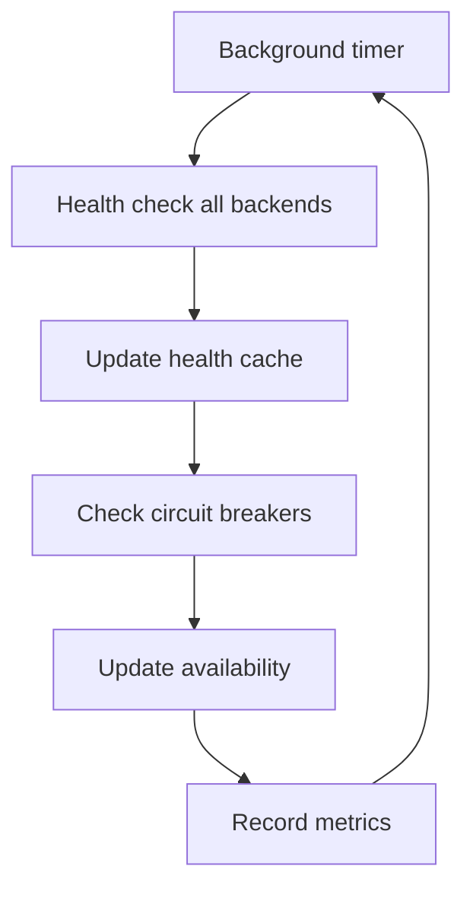

# Architecture Overview

Technical architecture documentation for Claudette v1.0.2.

## System Overview

Claudette is a TypeScript-based AI middleware platform designed for intelligent routing across multiple AI backends with cost optimization, health monitoring, and reliability features.

### Core Design Principles

1. **Performance First**: Sub-second routing decisions with minimal overhead
2. **Cost Optimization**: Intelligent backend selection based on cost, quality, and latency
3. **Reliability**: Circuit breaker patterns and graceful degradation
4. **Type Safety**: Full TypeScript implementation with comprehensive type definitions
5. **Extensibility**: Plugin architecture for backends and future enhancements

## High-Level Architecture

```
┌─────────────────────────────────────────────────────────────────────────────┐
│                           Application Layer                                  │
├─────────────────────────────────────────────────────────────────────────────┤
│                         Claudette Core API v1.0.2                           │
│                              optimize()                                       │
├──────────────┬──────────────┬──────────────┬──────────────┬──────────────────┤
│   Router     │   Cache      │   Health     │  Monitoring  │   Database       │
│   System     │   System     │   Monitor    │   Metrics    │   SQLite         │
├──────────────┼──────────────┼──────────────┼──────────────┼──────────────────┤
│        Backend Layer         │     Infrastructure Layer                      │
│   ┌─────┬─────┬─────────┐   │ ┌─────────┬─────────┬─────────────────────────┐ │
│   │OpenAI│Qwen│FlexCon │   │ │Timeout  │Circuit  │Error                    │ │
│   │     │    │(Ollama)│   │ │Manager  │Breakers │Handling                 │ │
│   └─────┴─────┴─────────┘   │ └─────────┴─────────┴─────────────────────────┘ │
└─────────────────────────────┴───────────────────────────────────────────────┘
```

## Core Components

### 1. Router System (`src/router/`)

The intelligent routing system that selects optimal backends for requests.

#### Key Files
- `index.ts` - Main router with health monitoring and circuit breakers
- `advanced-circuit-breaker.ts` - Circuit breaker implementation

#### Responsibilities
- Backend health monitoring (every 60 seconds)
- Circuit breaker management
- Performance-based backend selection
- Fallback handling
- Timeout management

#### Selection Algorithm
```typescript
// Weighted scoring for backend selection
const score = (
  costScore * 0.4 +           // 40% weight on cost
  latencyScore * 0.4 +        // 40% weight on performance  
  availabilityScore * 0.2     // 20% weight on reliability
);
```

### 2. Backend System (`src/backends/`)

Unified interface for multiple AI providers with consistent error handling.

#### Architecture Pattern
```typescript
// Base class pattern
abstract class BaseBackend {
  abstract healthCheck(): Promise<boolean>;
  abstract send(request: ClaudetteRequest): Promise<ClaudetteResponse>;
  // Common functionality: validation, error handling, metrics
}

// Concrete implementations
class OpenAIBackend extends BaseBackend { ... }
class QwenBackend extends BaseBackend { ... }
class OllamaBackend extends BaseBackend { ... } // FlexCon
```

#### Key Components
- `base.ts` - Abstract base class with common functionality
- `openai.ts` - OpenAI API integration
- `qwen.ts` - Alibaba Cloud DashScope integration
- `ollama.ts` - FlexCon/GPU model integration
- `shared-utils.ts` - Common utilities and error handling

### 3. Health Monitoring System

Real-time health monitoring with circuit breaker patterns.

#### Health Check Hierarchy
```
Background Health Monitor (11s timeout)
  └── Availability Check (8.3s timeout)
      └── Health Check (5.5s timeout)
          └── Backend API Call
```

#### Circuit Breaker States
```typescript
enum CircuitState {
  CLOSED,    // Normal operation - requests pass through
  OPEN,      // Failures detected - requests blocked
  HALF_OPEN  // Testing recovery - limited requests allowed
}
```

### 4. Cache System (`src/cache/`)

Response caching for performance optimization and cost reduction.

#### Cache Strategy
- **Storage**: SQLite database with MD5 hash keys
- **TTL**: 1 hour default (configurable)
- **Size**: 10,000 entries maximum
- **Key**: MD5 hash of prompt + options

#### Implementation
```typescript
// Cache workflow
const cacheKey = createHash('md5')
  .update(request.prompt + JSON.stringify(options))
  .digest('hex');

// Check cache first
const cached = await cache.get(cacheKey);
if (cached) return cached;

// Process request and cache result
const response = await processRequest(request);
await cache.set(cacheKey, response);
```

### 5. Configuration System (`src/config/`)

Environment-based configuration with validation and auto-correction.

#### Configuration Sources (Priority Order)
1. Environment variables
2. Configuration file (`claudette.config.json`)
3. Default values

#### Validation Pipeline
```typescript
// Configuration validation workflow
loadConfig() → validateConfig() → autoCorrect() → registerBackends()
```

### 6. Database System (`src/database/`)

SQLite-based persistence for caching and metrics.

#### Schema
```sql
-- Response cache
CREATE TABLE cache (
  key TEXT PRIMARY KEY,
  response TEXT,
  timestamp INTEGER,
  expires INTEGER
);

-- Cost tracking
CREATE TABLE quota (
  id INTEGER PRIMARY KEY,
  timestamp TEXT,
  backend TEXT,
  prompt_hash TEXT,
  tokens_input INTEGER,
  tokens_output INTEGER,
  cost_eur REAL,
  latency_ms INTEGER
);
```

## Data Flow

### Request Processing Flow

```mermaid
graph TD
    A[optimize() call] --> B[Input validation]
    B --> C[Cache check]
    C --> D{Cache hit?}
    D -->|Yes| E[Return cached response]
    D -->|No| F[Router selection]
    F --> G[Backend health check]
    G --> H{Backend healthy?}
    H -->|No| I[Try next backend]
    H -->|Yes| J[Send request]
    J --> K[Process response]
    K --> L[Cache response]
    L --> M[Return response]
    I --> G
```

### Health Monitoring Flow



## Performance Architecture

### Timeout Management

Claudette v1.0.2 uses calibrated timeouts based on empirical testing:

```typescript
// Optimized timeout hierarchy
const TIMEOUTS = {
  HEALTH_CHECK: 5500,          // 5.5s - accommodates all backends
  AVAILABILITY_CHECK: 8300,    // 8.3s - 1.5x health check
  BACKGROUND_HEALTH: 11000,    // 11s - 2x health check
  CIRCUIT_BREAKER_RESET: 45000, // 45s - recovery time
  REQUEST: 45000,              // 45s - main request timeout
  OPENAI_CLIENT: 15000         // 15s - OpenAI SDK timeout
};
```

### Backend Performance Characteristics

| Backend | Health Check P95 | Request Avg | Safety Margin |
|---------|------------------|-------------|---------------|
| OpenAI  | 964ms           | 1,102ms     | 5.7x (5500ms ÷ 964ms) |
| Qwen    | 1,056ms         | 912ms       | 5.2x (5500ms ÷ 1056ms) |
| FlexCon | 244ms           | 22,351ms    | 22.5x (5500ms ÷ 244ms) |

### Memory Management

```typescript
// Resource cleanup on shutdown
async cleanup() {
  // Stop background timers
  this.router.stopBackgroundHealthChecks();
  
  // Close database connections
  this.db.close();
  
  // Clear caches
  this.cache.clear();
  
  // Destroy connection pools
  globalConnectionPool.destroy();
}
```

## Security Architecture

### Credential Management

Multi-layer credential storage with automatic fallback:

```typescript
// Credential storage hierarchy
1. macOS Keychain (secure, persistent)
2. Encrypted file storage (cross-platform fallback)
3. Environment variables (development)
4. Configuration file (least secure)
```

### Input Validation

```typescript
// Security validations
function validateInput(prompt: string, files: string[]) {
  // Prevent null/undefined crashes
  if (prompt === null || prompt === undefined) throw error;
  
  // Prevent DoS attacks
  if (prompt.length > 1000000) throw error; // 1MB limit
  
  // Prevent directory traversal
  files.forEach(file => {
    if (file.includes('..') || file.includes('~')) throw error;
  });
  
  // Basic script injection detection
  if (prompt.includes('<script>')) logger.warn();
}
```

## Error Handling Architecture

### Error Hierarchy

```typescript
// Error classification system
abstract class ClaudetteError extends Error {
  code: string;
  backend?: string;
  retryable: boolean;
}

// Specific error types
class BackendError extends ClaudetteError { ... }
class RateLimitError extends ClaudetteError { ... }
class TimeoutError extends ClaudetteError { ... }
```

### Error Recovery Strategy

```typescript
// Multi-level error recovery
1. Request-level retry (same backend)
2. Backend fallback (different backend)
3. Circuit breaker (temporary backend disable)
4. Graceful degradation (mock backend in dev)
```

## Extensibility Architecture

### Plugin Interface (Future)

```typescript
// Planned plugin architecture for v1.2.0
interface BackendPlugin {
  name: string;
  initialize(config: BackendConfig): Promise<void>;
  healthCheck(): Promise<boolean>;
  send(request: ClaudetteRequest): Promise<ClaudetteResponse>;
}
```

### Configuration Extension Points

```typescript
// Current extension points
interface ClaudetteConfig {
  backends: { [name: string]: BackendSettings };
  features: FeatureFlags;
  thresholds: SystemThresholds;
  // Future: plugins, hooks, middleware
}
```

## Deployment Architecture

### Development Setup
```bash
# Local development
npm install
npm run build
./claudette --help
```

### Production Considerations
- Environment variable management
- Database persistence
- Health monitoring
- Cost tracking
- Error logging

## Performance Metrics

### Current Benchmarks (v1.0.2)
- **Initialization**: <1000ms
- **Router Decision**: <10ms
- **Cache Hit**: <5ms
- **Health Check**: 302-758ms average
- **Request Processing**: 912-1102ms average

### Monitoring Points
- Request latency per backend
- Cost accumulation over time
- Health check success rates
- Circuit breaker activations
- Cache hit/miss ratios

## Future Architecture Plans

### v1.1.0 Planned Enhancements
- Enhanced setup wizard
- Dashboard interface
- Advanced monitoring
- Additional backend support

### v1.2.0 Architectural Changes
- Plugin system implementation
- RAG system completion
- Distributed deployment support
- Advanced cost optimization

---

*This architecture documentation reflects the actual v1.0.2 implementation and is updated to match the current codebase.*